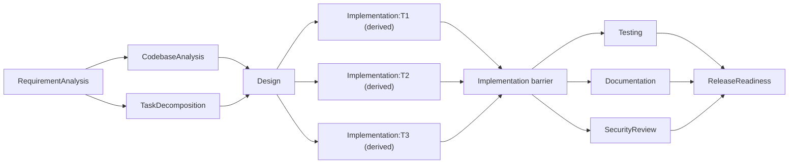
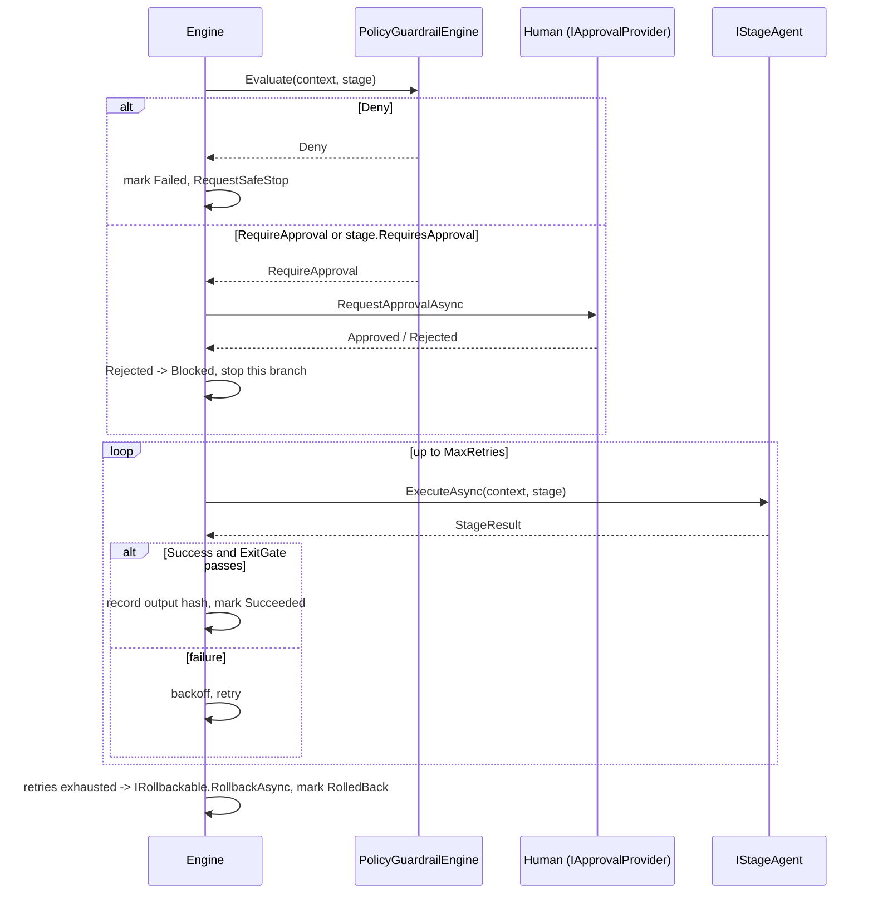

# Architecture

## Why two systems in one repo

The assignment's actual grading target is the **orchestration layer**, not the URL
shortener — the shortener is the subject matter it operates on. So the repo is
structured as a real product (`UrlShortener.*`) plus an orchestration engine
(`Orchestrator.*`) that treats changes to that product as its work items. Keeping
them as separate, independently-buildable projects means the engine has no
compile-time dependency on the product it's orchestrating — a real version of this
system would point the same engine at any codebase.

## Components

```
UrlShortener.Domain          <- entities (ShortUrl, ClickEvent), IShortCodeGenerator
UrlShortener.Application     <- IUrlShortenerService (create/resolve/analytics/expire)
UrlShortener.Infrastructure  <- EF Core DbContext + repositories over SQLite
UrlShortener.Api             <- controllers, rate limiting, Swagger, Program.cs wiring

Orchestrator.Core            <- WorkflowGraph, WorkflowEngine, WorkflowContext,
                                 PolicyGuardrailEngine, MetricsCollector, IApprovalProvider
Orchestrator.Agents          <- IStageAgent implementations, AnthropicLlmClient,
                                 CodebaseScanner, WorkTask/WorkTaskPlan
Orchestrator.Cli             <- wires the static stages per scenario and runs them
```

`Orchestrator.Core` depends on nothing product-specific — its types are `StageDefinition`,
`IStageAgent`, `WorkflowContext`, etc. `Orchestrator.Agents` is where the URL-shortener
domain knowledge lives (each agent's prompts talk about the shortener), and
`Orchestrator.Cli` is the only place that references both `Orchestrator.*` and knows
the shortener's source tree exists (it shells out to `dotnet test` against it).

## The orchestration model

The static graph is nine stages, and the executed graph is bigger than that — the
decomposition stage derives implementation stages from the requirement at runtime:



Three kinds of concurrency appear here, and none of them are scripted — the scheduler
(`WorkflowEngine.RunAsync`) discovers what can run at each tick from the declared
dependencies:

- `CodebaseAnalysis` ∥ `TaskDecomposition` (both only need the normalized requirement).
- The derived `Implementation:T*` stages, which run as wide as the task DAG allows —
  tasks the decomposition marked independent execute concurrently, tasks it sequenced
  wait.
- `Testing` ∥ `Documentation` ∥ `SecurityReview`, fanning back into `ReleaseReadiness`.

`Design` and `ReleaseReadiness` are synchronization barriers by virtue of having several
dependencies; the `Implementation` barrier is one whose dependency list is itself built
at runtime.

### The graph is derived from the requirement, not hardcoded

`TaskDecompositionAgent` converts the normalized requirement into a task DAG — ids,
dependencies, and topologically-computed execution waves — validates it
(`WorkTaskPlan.TryValidate` rejects unknown dependencies, duplicate ids and cycles), and
then calls `WorkflowContext.RequestStages` to add one implementation stage per task,
wiring the pre-existing `Implementation` barrier to depend on all of them. So a
requirement that decomposes into four tasks produces a materially different executed
graph from one that decomposes into six. A plan that fails validation is never turned
into stages: the agent falls back to a deterministic decomposition rather than building
a graph from unvalidated generated structure.

Expansion requests are queued and committed by the engine *between* scheduling ticks, so
the graph is never mutated while stages execute concurrently. `WorkflowGraph.AddStages`
validates and commits atomically; a rejected expansion (cycle, unknown dependency,
duplicate id, or a barrier that already started) trips safe-stop rather than silently
dropping the work the stage planned.

### Dependency rules: what a skipped stage means downstream

Stages declare how they treat a dependency that finished without succeeding, mirroring
the trigger-rule idea in mature workflow engines:

- **`AllSucceeded`** (default) — every dependency must have succeeded. A dependency that
  was `Skipped` cascades the skip, because the output this stage needed will never exist.
- **`AllSettled`** — `Succeeded` or `Skipped` both count. `Design` uses this so it still
  runs when `CodebaseAnalysis` was gated out on a greenfield change, and
  `ReleaseReadiness` uses it so a security review that was correctly inapplicable doesn't
  block the release gate.

Without this distinction, any conditionally-skipped stage would poison everything
downstream of it — which is exactly what made entry gates unusable in an earlier
revision of this engine.

### Scheduling loop

Each tick:
1. **Propagate blocking/skipping.** A stage whose dependency Failed, was Blocked, or was
   RolledBack becomes `Blocked`. A stage whose dependency was `Skipped` (its `EntryGate`
   returned false) cascades to `Skipped` itself, transitively — this stops a
   deliberately-gated-out branch from deadlocking its descendants.
2. **Find ready stages**: `Pending`/`Stale` stages whose dependencies are all `Succeeded`.
   Evaluate each one's `EntryGate`; a false gate marks it `Skipped` instead of running it.
3. **Run every remaining ready stage concurrently** (`Task.WhenAll`).
4. Repeat until nothing is ready. No ready stages with something still `Pending`/`Stale`
   is a **deadlock** (reported in `RunReport.StopReason`, not a hang) — kept as a
   defensive completeness check even though, for any graph that passed
   `WorkflowGraph`'s constructor validation (which rejects cycles), it's provable by
   induction over topological depth that every stage's dependencies eventually resolve
   to a terminal status and the cascade in step 1 propagates fully before the loop can
   observe zero progress. In practice this branch is unreachable for a validly
   constructed graph; it stays in as a guard against a future change to the scheduling
   logic silently reintroducing a real deadlock.

### Per-stage execution: guardrails → approval → retry → rollback



Every stage passes through the same pipeline regardless of whether it calls an LLM —
`ReleaseReadiness` is entirely deterministic and still goes through guardrails/approval/
retry machinery, because the engine doesn't know or care whether a stage is
model-backed.

### Entry and exit gates in the shipped pipeline

Gates are not just an available mechanism here; the pipeline uses them:

| Stage | Gate | What it enforces |
|---|---|---|
| `CodebaseAnalysis` | Entry | Only scans and reasons about existing code when the change lands in an existing system. A greenfield run records `Skipped` rather than claiming to have analyzed a codebase that isn't there. |
| `SecurityReview` | Entry | Only runs when the requirement, design or implementation touches a security-sensitive surface (`SecurityReviewAgent.IsApplicable`). In the greenfield/brownfield/ambiguous runs it is correctly `Skipped`; in the `security` scenario it runs. |
| `TaskDecomposition` | Exit | A decomposition reporting success but producing zero tasks is not a usable plan — the exit gate fails it and the retry policy takes over. |
| `Testing` | Exit | If the stage claims it ran the real suite, the suite must have passed. Stops a stage reporting success while carrying a failing test result. |

### Governance mechanisms (mapped to the assignment's checklist)

| Requirement | Where it lives |
|---|---|
| Explicit dependency graph, entry/exit gates | `WorkflowGraph`, `StageDefinition.EntryGate`/`ExitGate` — wired on four stages, see the table above |
| Task decomposition into actionable tasks with dependencies and sequencing | `TaskDecompositionAgent` + `WorkTaskPlan`, whose output becomes real graph stages |
| Codebase reasoning over impacted modules/APIs/data flows | `CodebaseScanner` (reads the real repo) + `CodebaseAnalysisAgent` |
| Sequential + parallel paths with synchronization | `WorkflowEngine` scheduling loop — three concurrency points, see above |
| Cross-stage context + decision lineage | `WorkflowContext.SharedState` via `GetResult`/`SetResult`, `DecisionLineage` |
| Human approval checkpoints for **high-impact** actions | `IApprovalProvider`, `StageDefinition.RequiresApproval`, and `StageDefinition.HighImpact` which scopes policy escalation to stages that actually produce a change |
| Bounded retries, fallback, rollback, safe-stop | `StageDefinition.MaxRetries`/`RetryBaseDelay`, `IRollbackable`, `WorkflowContext.RequestSafeStop` |
| Policy guardrails (security/compliance/change control) | `IPolicyRule` — `SecuritySensitiveChangeRule` and `DestructiveOperationRule` escalate to approval; `HardcodedCredentialRule` **denies** outright and trips safe-stop |
| Audit-grade observability/traceability | `WorkflowContext.AuditLog` (every state transition, timestamped) |
| Reliability metrics (success rate, retry/rollback frequency, MTTR, latency) | `MetricsCollector` / `RunMetrics` |
| Dynamic re-planning when upstream output changes | `WorkflowContext.RecordOutputHash` + `WorkflowEngine.Replan`, driven via the `resumeFrom` parameter on `RunAsync` — see `--simulate-replan` in [setup.md](setup.md) |

## Hybrid agents: LLM + offline fallback

Each `IStageAgent` in `Orchestrator.Agents` calls `AnthropicLlmClient` first. If
`ANTHROPIC_API_KEY` isn't set, or the call fails for any reason, `AgentBase.CompleteWithFallbackAsync`
catches `LlmUnavailableException` and falls back to a small deterministic offline
implementation (keyword-based ambiguity detection, templated design/doc text) — the
pipeline still runs to completion and produces a real `RunReport`, just with less
insight. This was a deliberate reliability choice: an orchestration engine whose
correctness depends on an external API being reachable is not something you'd want
gating a release pipeline. The `ReleaseReadiness` stage has no LLM dependency at all —
a go/no-go gate should be auditable, reproducible code, not a model call.

The `TestingAgent` is the one stage where "validation" is a real, external fact rather
than a model's self-report: it actually shells out to `dotnet test` against the
solution (unless `--skip-real-tests` is passed) and the stage's success is the real
exit code, not the LLM's opinion of whether the tests would pass.

## Key decisions and why

- **The Implementation stage writes to `artifacts/runs/<runId>/`, not to the real
  source tree.** An agent editing a live codebase with no human merge gate is exactly
  the high-impact action this system's approval checkpoints exist to prevent. A human
  reviews the generated diff/artifact and applies it — a production version would open
  it as a PR, keeping the same approval semantics but making the artifact a real,
  revertible commit instead of a file the CLI wrote.
- **Stage 1 (`RequirementAnalysis`) fails loud on ambiguity instead of guessing.** It
  returns a non-empty `ambiguities`/`clarifyingQuestions` list rather than silently
  picking an interpretation — see the [ambiguous scenario](scenarios/ambiguous.md).
- **`ReleaseReadiness` always "succeeds" as a stage; the GO/NO-GO decision lives in its
  output, not its `Success` flag.** A NO-GO is a valid business outcome, not something
  retries could ever fix — treating it as a stage failure would just waste retry budget.
- **The engine seeds its status map from an optional `resumeFrom` parameter rather than
  always starting fresh.** This is what makes dynamic re-planning something you can
  actually trigger and observe (via `--simulate-replan`) instead of unreachable
  machinery — see [setup.md](setup.md) for the walkthrough.
- **Policy escalation is scoped to high-impact stages.** A single sensitive word in a
  requirement used to demand approval on every stage in the run, including the read-only
  analysis ones. That's how you train a reviewer to click through approvals without
  reading them, so `SecuritySensitiveChangeRule` and `DestructiveOperationRule` now only
  escalate stages marked `HighImpact` — the design and the code-generating stages.
- **One rule denies instead of asking.** Everything else routes to a human, but
  `HardcodedCredentialRule` returns `Deny` and trips safe-stop: shipping a credential in
  source isn't a trade-off someone should be able to approve their way past under time
  pressure. It's the difference between a guardrail and a speed bump.
- **The codebase scanner is regex-over-source, not a Roslyn workspace.** It has to be
  dependency-free and fast enough to run inside a pipeline stage, and the questions it
  answers — which project owns this route, what entity sets exist, which files mention
  this requirement's terms — don't need a full semantic model. The trade-off is that it
  can be fooled by unusual formatting; it's an impact-assessment aid for the design
  stage, not a compiler.
