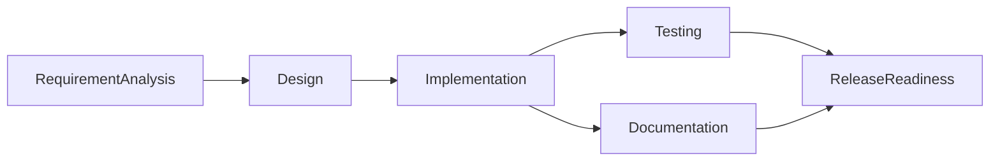
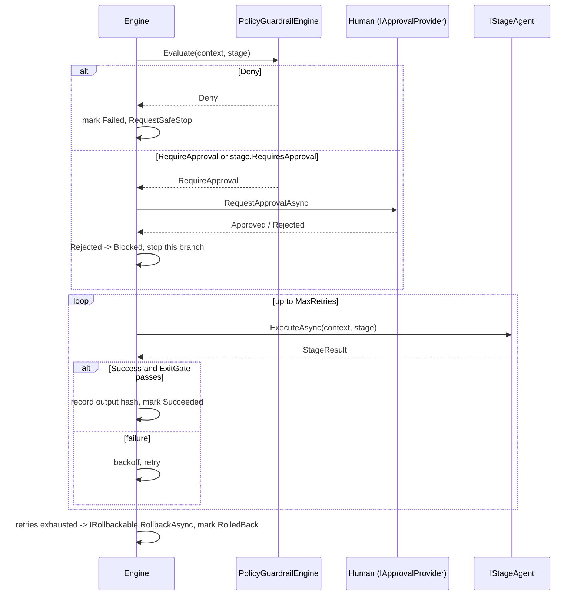

# Architecture

## Why two systems in one repo

The assignment's actual grading target is the **orchestration layer**, not the URL
shortener — the shortener is the subject matter it operates on. So the repo is
structured as a real product (`UrlShortener.*`) plus an orchestration engine
(`Orchestrator.*`) that treats changes to that product as its work items. Keeping
them as separate, independently-buildable projects means the engine has no
compile-time dependency on the product it's orchestrating — a real version of this
system would point the same engine at any codebase.

## Components

```
UrlShortener.Domain          <- entities (ShortUrl, ClickEvent), IShortCodeGenerator
UrlShortener.Application     <- IUrlShortenerService (create/resolve/analytics/expire)
UrlShortener.Infrastructure  <- EF Core DbContext + repositories over SQLite
UrlShortener.Api             <- controllers, rate limiting, Swagger, Program.cs wiring

Orchestrator.Core            <- WorkflowGraph, WorkflowEngine, WorkflowContext,
                                 PolicyGuardrailEngine, MetricsCollector, IApprovalProvider
Orchestrator.Agents          <- IStageAgent implementations, AnthropicLlmClient
Orchestrator.Cli             <- wires a concrete 6-stage graph per scenario and runs it
```

`Orchestrator.Core` depends on nothing product-specific — its types are `StageDefinition`,
`IStageAgent`, `WorkflowContext`, etc. `Orchestrator.Agents` is where the URL-shortener
domain knowledge lives (each agent's prompts talk about the shortener), and
`Orchestrator.Cli` is the only place that references both `Orchestrator.*` and knows
the shortener's source tree exists (it shells out to `dotnet test` against it).

## The orchestration model

Six stages, wired as a dependency graph rather than a linear chain:



`Testing` and `Documentation` both depend only on `Implementation`, so the engine runs
them **concurrently** — `ReleaseReadiness` depends on both, making it a synchronization
barrier that can't proceed until both parallel branches finish. This is the
non-linear, stateful execution the assignment calls out as the critical differentiator:
the graph is declarative (`StageDefinition.DependsOn`), and the scheduler
(`WorkflowEngine.RunAsync`) discovers what can run concurrently at each tick rather than
being told to.

### Scheduling loop

Each tick:
1. **Propagate blocking/skipping.** A stage whose dependency Failed, was Blocked, or was
   RolledBack becomes `Blocked`. A stage whose dependency was `Skipped` (its `EntryGate`
   returned false) cascades to `Skipped` itself, transitively — this stops a
   deliberately-gated-out branch from deadlocking its descendants.
2. **Find ready stages**: `Pending`/`Stale` stages whose dependencies are all `Succeeded`.
   Evaluate each one's `EntryGate`; a false gate marks it `Skipped` instead of running it.
3. **Run every remaining ready stage concurrently** (`Task.WhenAll`).
4. Repeat until nothing is ready. No ready stages with something still `Pending`/`Stale`
   is a **deadlock** (reported in `RunReport.StopReason`, not a hang) — kept as a
   defensive completeness check even though, for any graph that passed
   `WorkflowGraph`'s constructor validation (which rejects cycles), it's provable by
   induction over topological depth that every stage's dependencies eventually resolve
   to a terminal status and the cascade in step 1 propagates fully before the loop can
   observe zero progress. In practice this branch is unreachable for a validly
   constructed graph; it stays in as a guard against a future change to the scheduling
   logic silently reintroducing a real deadlock.

### Per-stage execution: guardrails → approval → retry → rollback



Every stage passes through the same pipeline regardless of whether it calls an LLM —
`ReleaseReadiness` is entirely deterministic and still goes through guardrails/approval/
retry machinery, because the engine doesn't know or care whether a stage is
model-backed.

### Governance mechanisms (mapped to the assignment's checklist)

| Requirement | Where it lives |
|---|---|
| Explicit dependency graph, entry/exit gates | `WorkflowGraph`, `StageDefinition.EntryGate`/`ExitGate` |
| Sequential + parallel paths with synchronization | `WorkflowEngine` scheduling loop (Testing ∥ Documentation → ReleaseReadiness) |
| Cross-stage context + decision lineage | `WorkflowContext.SharedState` via `GetResult`/`SetResult`, `DecisionLineage` |
| Human approval checkpoints | `IApprovalProvider` (`ConsoleApprovalProvider` / `AutoApprovalProvider`), `StageDefinition.RequiresApproval` |
| Bounded retries, fallback, rollback, safe-stop | `StageDefinition.MaxRetries`/`RetryBaseDelay`, `IRollbackable`, `WorkflowContext.RequestSafeStop` |
| Policy guardrails (security/compliance/change control) | `IPolicyRule` (`SecuritySensitiveChangeRule`, `DestructiveOperationRule`), `PolicyGuardrailEngine` |
| Audit-grade observability/traceability | `WorkflowContext.AuditLog` (every state transition, timestamped) |
| Reliability metrics (success rate, retry/rollback frequency, MTTR, latency) | `MetricsCollector` / `RunMetrics` |
| Dynamic re-planning when upstream output changes | `WorkflowContext.RecordOutputHash` + `WorkflowEngine.Replan`, driven via the `resumeFrom` parameter on `RunAsync` — see `--simulate-replan` in [setup.md](setup.md) |

## Hybrid agents: LLM + offline fallback

Each `IStageAgent` in `Orchestrator.Agents` calls `AnthropicLlmClient` first. If
`ANTHROPIC_API_KEY` isn't set, or the call fails for any reason, `AgentBase.CompleteWithFallbackAsync`
catches `LlmUnavailableException` and falls back to a small deterministic offline
implementation (keyword-based ambiguity detection, templated design/doc text) — the
pipeline still runs to completion and produces a real `RunReport`, just with less
insight. This was a deliberate reliability choice: an orchestration engine whose
correctness depends on an external API being reachable is not something you'd want
gating a release pipeline. The `ReleaseReadiness` stage has no LLM dependency at all —
a go/no-go gate should be auditable, reproducible code, not a model call.

The `TestingAgent` is the one stage where "validation" is a real, external fact rather
than a model's self-report: it actually shells out to `dotnet test` against the
solution (unless `--skip-real-tests` is passed) and the stage's success is the real
exit code, not the LLM's opinion of whether the tests would pass.

## Key decisions and why

- **The Implementation stage writes to `artifacts/runs/<runId>/`, not to the real
  source tree.** An agent editing a live codebase with no human merge gate is exactly
  the high-impact action this system's approval checkpoints exist to prevent. A human
  reviews the generated diff/artifact and applies it — a production version would open
  it as a PR, keeping the same approval semantics but making the artifact a real,
  revertible commit instead of a file the CLI wrote.
- **Stage 1 (`RequirementAnalysis`) fails loud on ambiguity instead of guessing.** It
  returns a non-empty `ambiguities`/`clarifyingQuestions` list rather than silently
  picking an interpretation — see the [ambiguous scenario](scenarios/ambiguous.md).
- **`ReleaseReadiness` always "succeeds" as a stage; the GO/NO-GO decision lives in its
  output, not its `Success` flag.** A NO-GO is a valid business outcome, not something
  retries could ever fix — treating it as a stage failure would just waste retry budget.
- **The engine seeds its status map from an optional `resumeFrom` parameter rather than
  always starting fresh.** This is what makes dynamic re-planning something you can
  actually trigger and observe (via `--simulate-replan`) instead of unreachable
  machinery — see [setup.md](setup.md) for the walkthrough.
